---
title: "Trabajo Práctico 3 - Clasificación CIFAR10"
subtitle: "Tecnología Digital VI: Inteligencia Artificial"
author: [Federico Giorgi,Gastón Loza Montaña,Tomás Curzio]
date: "04/11/23"
geometry: "left=3cm,right=3cm,top=2.5cm,bottom=2.5cm"
lang: "es"
...

# Configuración

Para este inciso del trabajo, utilizamos el código otorgado por la cátedra. Creamos nuestras cuentas de W&B así como un equipo, con el cual creamos un proyecto, para que todos los integrantes podamos acceder a los distintos gráficos, la metadata y la configuración de nuestros experimentos. Agregamos al código otorgado la siguiente linea para guardar la loss y accuracy tanto en `training` como en `validation`, luego de cada epoch, en W&B:

```python
wandb.log({ "train_accuracy": train_accuracy, "val_accuracy": val_accuracy, 
  "train_loss": running_loss, "val_loss": val_loss})
```

También, modificamos levemente el método `transform`, para incluir *data augmentation*, ya que se mencionó en clase que era un pre-procesamiento de datos habitual. En un principio lo agregamos a `transform`, lo cual nos dimos cuenta era un error, pues esa transformación también se aplica a `validation` y `test`, cuando nosotros solo la queremos en `training`. Para ello, modificamos el código de esta manera:

```python
transform_train = transforms.Compose([
  transforms.RandomHorizontalFlip(p=0.5),
  transforms.ToTensor(),
  transforms.Normalize((0.5, 0.5, 0.5), (0.5, 0.5, 0.5))
])

transform = transforms.Compose([
  transforms.ToTensor(),
  transforms.Normalize((0.5, 0.5, 0.5), (0.5, 0.5, 0.5))
])

# Descargo el dataset CIFAR10, divido en training, validation, testing.
trainset = torchvision.datasets.CIFAR10(root='./data', train=True, download=True, 
                                    transform=transform_train)
valset = torchvision.datasets.CIFAR10(root='./data', train=True, download=True, 
                                    transform=transform)
targets_ = trainset.targets
train_idx, val_idx = train_test_split(np.arange(len(targets_)), test_size=0.2, 
                                    stratify=targets_)
train_sampler = torch.utils.data.SubsetRandomSampler(train_idx)
val_sampler = torch.utils.data.SubsetRandomSampler(val_idx)

trainloader = torch.utils.data.DataLoader(trainset, sampler=train_sampler,
                                    batch_size=batch_size, num_workers=2)
valloader = torch.utils.data.DataLoader(valset, sampler=val_sampler,
                                    batch_size=batch_size, num_workers=2)

testset = torchvision.datasets.CIFAR10(root='./data', train=False, download=True, 
                                    transform=transform)
```

Sin embargo, no vimos este error en un comienzo, y algunos de nuestros experimentos de los cuales se habla en este informe fueron corridos con ese error. Al haber cometido el mismo error en todos estos experimentos, consideramos que son comparables entre sí y que podemos utilizar esa información para tomar decisiones. De igual manera, re-hicimos varios de estos experimentos, y, afortunadamente, nos dieron muy similares, haciendonos ver que el error no fue un factor determinante en los resultados. A continuación se pueden ver algunos ejemplos.


# Arquitectura

Para comenzar a clasificar, mantuvimos los parámetros que se encontraban en el código otorgado, sólo cambiando `epochs` a 50, para darle una oportunidad a todas nuestras estructuras de entrenar un poco mas, ya que muchas veces con 10 epochs podíamos observar potencial de seguir creciendo y se cortaba. Esto nos deja con los siguientes parámetros para todos los experimentos mencionados en esta sección (notar que, si cambiamos algo más que la estructura, la mejora o desmejora se puede deber a esa otra cosa que se cambia en lugar a la estructura, que es lo que estamos intentando perfeccionar).

```python
# Parametros
batch_size = 32
learning_rate = 0.02
momentum = .9
epochs = 50
```

Además, en todas los experimentos utilizamos la misma función de activación (ReLU), para asegurarnos de que en efecto lo único que cambiaba era la arquitectura, haciendolos comparables entre sí.

Para sentar una base de performance, corrimos el modelo que venía en el código `MLP`. No obtuvimos la mejor de las performances con un 53% de accuracy en validation en su mejor epoch, pero sirvió para entender donde estabamos parados. Luego, probamos distintas arquitecturas, entre ellas:

- `relu_layer_div2`: Dividiendo entre 2 todo el tiempo la cantidad de features, desde $32 \cdot 32 \cdot 3$ hasta llegar a las 10 features que deben salir de output (pues hay 10 clases a clasificar).
- `relu_layer_div4`: Dividiendo entre 4, desde $32 \cdot 32 \cdot 3$ hasta 10.
- `relu_div4_div2`: Intercalando divisiones entre 4 y 2, desde $32 \cdot 32 \cdot 3$ hasta 10.
- `relu_6_layer_divrand`: Con 6 capas sin ningún criterio para la disminución de features.
- `relu_4_layer_divrand`: Con 4 capas sin ningún criterio para la disminución de features.

Entre estas arquitecturas, varias de sus perfomances fueron similares, pero obtuvimos una arquitectura que fue mejor que las demás. Sin embargo la diferencia no fue mucha y la accuracy, si bien subió bastante, parecía llegar a un techo con este tipo de redes, o al menos no obtuvimos resultados mucho mejores que un 55% (esto, sin optimizar hiperparámetros). En las prácticas hemos hablado de que estos problemas de clasificación de imágenes se suelen resolver con redes convolucionales, por lo que decidimos pasar primero a este tipo de redes antes de seguir con los siguientes puntos de probar optimizadores, regularizadores y distintos hiperparámetros, pues consideramos que es lo mas razonable con el fin de obtener un mejor modelo de clasificación.

En las figuras dos y tres, se puede observar la accuracy y loss de tanto nuestros experimentos (dos de similares resultados) en cuanto a arquitecturas de redes densas se refiere. Como se puede ver en la figura cuatro, los mejores resultados fueron obtenidos dividiendo por 2 y dividiendo por 4 las features a medida que agregabamos capas, por lo cual utilizaremos esta idea en las layers fully conected luego de las convoluciones, en la siguiente sección de este informe.


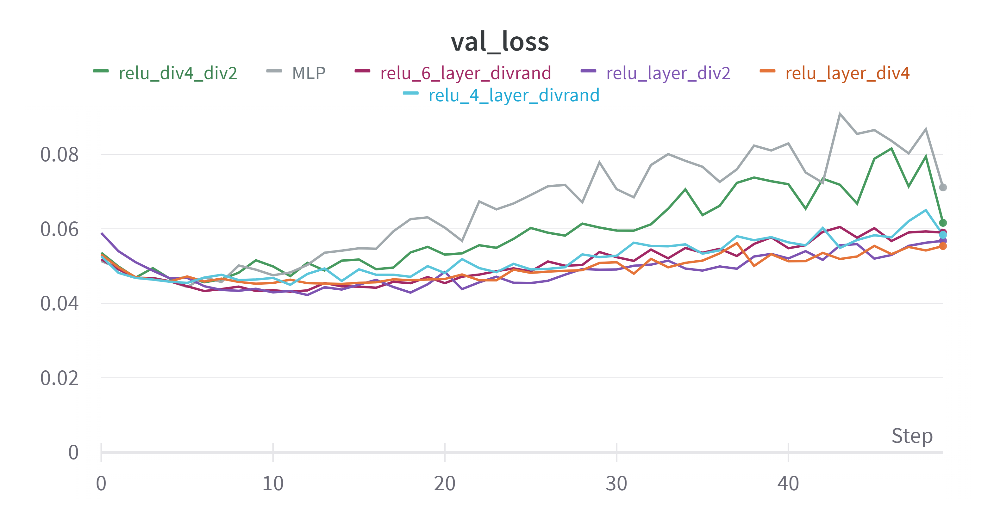

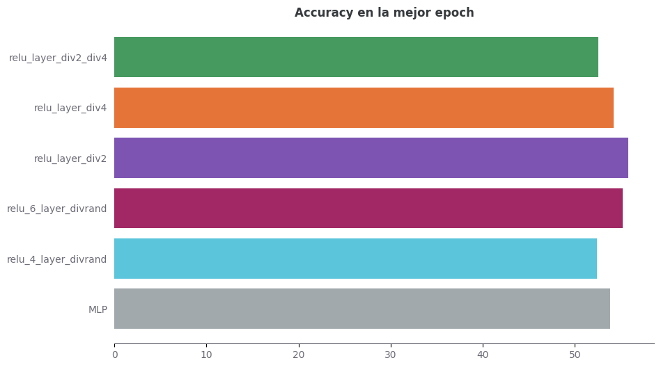

# Arquitectura CNN

Para experimentar arquitecturas de redes convolucionales, seguimos un procedimiento similar al realizado para las arquitecturas previas. Comenzamos corriendo al red convolucional provista (`default_conv`) para marcar ciero *benchmark*. A partir de allí, probamos las siguientes arquitecturas de CNNs:

- `simple_cnn`: Conformada por una primera capa convolucional que toma los 3 canales originales (RGB) y aplica 32 filtros de convolución con un kernel de tramaño 3x3 y un padding de 1. Luego una capa de agrupación (pooling) que reduce a la mitad el tamaño espacial de entrada, y una segunda capa convolucional que aplica 64 filtros con un kernel de 3x3 y padding. Finalmente termina con 2 capas *fully connected* para llegar a los 10 outputs.
- `simple_cnn_arq_2`: A las mismas capas de convolución y pooling de la arquitectura anterior, le aplicamos capas *fully connected* dividiendo entre 2, desde $64*8*8$ a $10$, pues fue la arquitectura que mejor perfemance anteriormente.
- `simple_cnn_arq_4`: al igual que la arquitectura anterior pero diviendo entre 4 las capas *fully connected*.

Si bien con estas arquitecturas de CNN logramos notables mejoras con respecto a las arquitecturas sin capas convolucionales (con accuracy por encima de $0.7$), dado que se sugirió desde la cátedra probar arquitecturas famosas, probamos la Resnet. Para ello, importamos desde el sub-paquete `torchvision.models` el modelo pre entrenado `resnet50` de la siguiente manera:

```python
import torchvision.models as models

class NetConv(nn.Module):
  def __init__(self):
    super().__init__()

    # Cargamos el modelo ResNet-50 con los pesos pre-entrenados
    self.resnet50 = models.resnet50(pretrained=True)

    # Y a continuación las capas fully-connected según nuestro mejores
    # resultados dividiendo entre 4
    num_features = self.resnet50.fc.in_features
      self.resnet50.fc = nn.Sequential(
        nn.Linear(num_features, 1024),
        nn.ReLU(),
        nn.Linear(1024, 256),
        nn.ReLU(),
        nn.Linear(256, 64),
        nn.ReLU(),
        nn.Linear(64, 16),
        nn.ReLU(),
        nn.Linear(16, 10)
      )

    def forward(self, x):
      x = self.resnet50(x)
      return x
```

Si bien, cargamos el modelo con sus pesos pre-entrenados, por default los parámetros son importados como `param.requires_grad = True` lo que significa que serán modificados al entrenar con el dataset CIFAR10.

En las figuras 5, 6 y 7, podemos ver que nuestras CNNs con capas totalmente conectadas con división entre 4 y 2 superan a la simple y a la default, lo cuál parece tener sentido considerando nuestros previos experimentos. A su vez, es notable que la Resnet supera las otras redes ya que su accury supera el 80%.


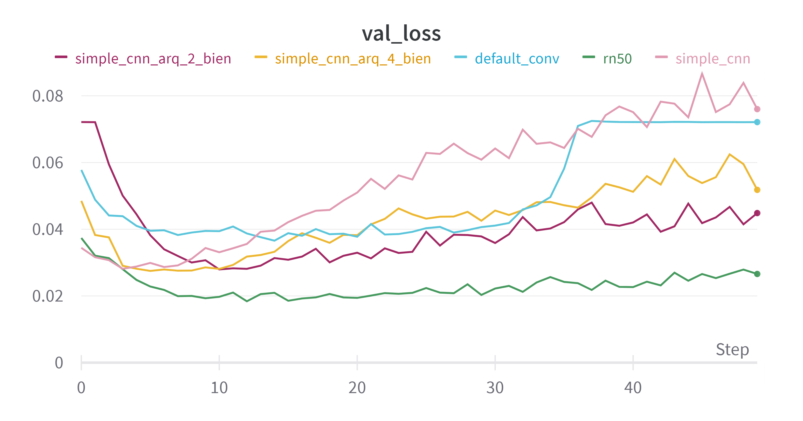

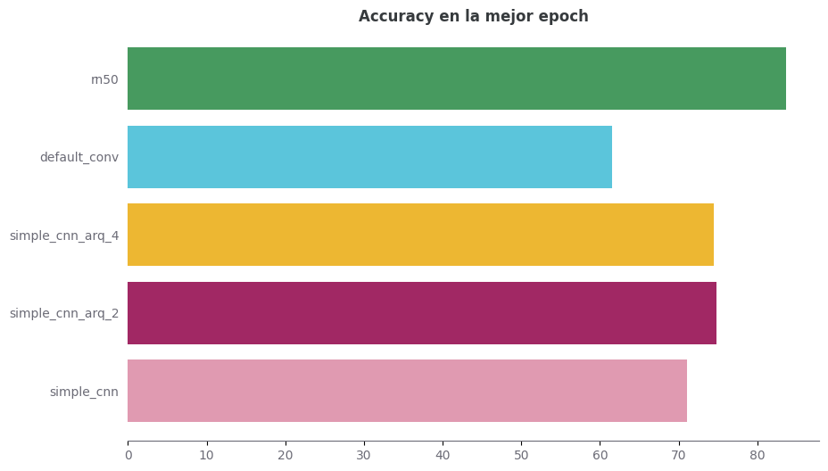

# Funciones de activación

A partir de nuestra mejor arquitectura con los experimentos previos (`rn50`), procedemos a experimentar con distantas funciones de activación entre las capas no convolucionales. Decidimos comparar la Resnet con ReLU (realizada anteriormente) con los siguientes experimentos:

- `rn50_leakyRelu`
- `rn50_sigmoid`
- `rn50_elu`
- `rn50_silu`

Como se puede observar en las figuras 8, 9 y 10, con excepción de la función de activación *Sigmoid*, los resultados fueron bastante similares con una leve superioridad de la función de actiación *ELU*.


# Optimizadores

Hasta ahora todos los experimentos fueron realizados con el optimizador SGD, el cuál ya venía configurado en el código provisto. A partir de allí, decidimos tomar nuestra mejor arquitectura y con su mejor función de activación (`rn50_elu`) con distintos algoritmos de optimización y/o de sheduling:

- `rn50_elu_adagrad`: Aplicamos el optimizador *Adagrad* incluido en torch a todos los parámetros con `learning_rate_inicial` en $0.02$.
- `rn50_elu_adadelta`: Aplicamos el optimizador *Adadelta* incluido en torch a todos los parámetros con `learning_rate_inicial` en $0.02$.
- `rn50_elu_sgd_expo_sheduler`: Aplicamos el optimizador *SGD* incluido en torch a todos los parámetros junto al sheduler *ExponentialLR*.
- `rn50_elu_adadelta_expo_sheduler`: Aplicamos el optimizador *Adadelta* incluido en torch a todos los parámetros junto al sheduler *ExponentialLR*.

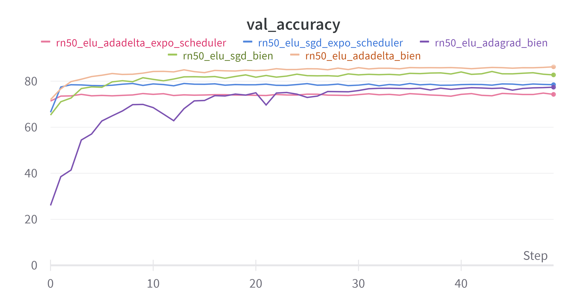

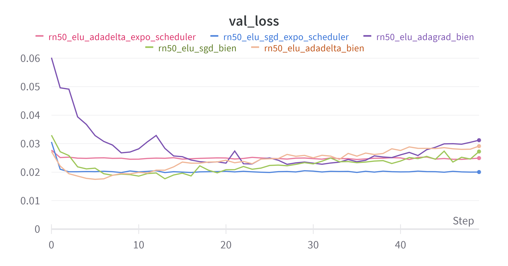

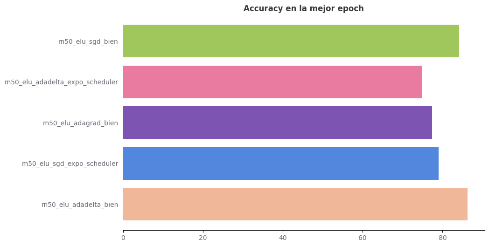

Notamos por las figuras 11, 12 y 13, que la combinación de optimizadores y shedulers al mismo tiempo no parecen tener tan buen resultado comparado a la mejor perfomance entre estos experimentos del que corre únicamene *Adadelta* sin ningún sheduler.

Con este experimentos ya podemos pasar a anlizar los hiperparámetros de entrenamiento.

# Entrenamiento

Partiendo de la base del modelo que mejor nos había dado hasta el momento `rn50_elu_adadelta`, decidimos empezar a optimizar los hiperparámetros de batch_size, learning_rate y la cantidad de epochs. Para ello, transformamos el código del entrenamiento en una función que devuelve la `best_accuracy` en validation y utilizamos hyperopt para buscar hiperparámetros en un espacio random razonable. Debido al costo computacional no realizamos muchas evaluaciones, pero logramos obtener hiperparámetros que mejoraron nuestro rendimiento en validation.

El código utilizado fué el siguiente:

```python
def train_and_evaluate_network(initial_learning_rate, batch_size, num_epochs):
  # Defino la red
  net = NetConv()
  net.to(device)

  # Cargo los datasets segun el batch size
  trainloader = torch.utils.data.DataLoader(trainset, sampler=train_sampler,batch_size=batch_size, num_workers=2)
  valloader = torch.utils.data.DataLoader(valset, sampler=val_sampler,batch_size=batch_size, num_workers=2)

  # Defino la loss, optimizador y scheduler
  criterion = nn.CrossEntropyLoss()
  optimizer = optim.Adadelta(net.parameters(), lr=initial_learning_rate)

  # Entrenamiento de la CNN
  best_accuracy = 0
  best_epoch = -1

  for epoch in range(num_epochs):
    running_loss = 0.0
    train_correct = 0
    total = 0
    for i, data in enumerate(trainloader, 0):
      inputs, labels = data[0].to(device), data[1].to(device)

      optimizer.zero_grad()
      outputs = net(inputs)

      loss = criterion(outputs, labels)
      loss.backward()
      optimizer.step()

      # Printeo el progreso cada 200 mini-batches.
      running_loss += loss.item()
      if i % 200 == 199:
        print(f'[{epoch + 1}, {i + 1:5d}] loss: {running_loss / 2000:.3f}')


      _, predicted = torch.max(outputs.data, 1)
      total += labels.size(0)
      train_correct += (predicted == labels).sum().item()

    # Validacion
    train_accuracy = 100 * train_correct / total
    running_loss = running_loss / total

    val_correct = 0
    total = 0
    val_loss = 0

    with torch.no_grad():
      for data in valloader:
        images, labels = data[0].to(device), data[1].to(device)
        outputs = net(images)
        _, predicted = torch.max(outputs.data, 1)
        total += labels.size(0)
        val_correct += (predicted == labels).sum().item()
        val_loss += criterion(outputs, labels).item()

    # Para estadisticas en wandb
    val_accuracy = 100 * val_correct / total
    val_loss = val_loss / total

    if val_accuracy > best_accuracy:
      best_accuracy = val_accuracy
      best_epoch = epoch
      best_model_state_dict = net.state_dict()

  # Indico por consola cuando finalizó el entrenamiento
  print(f"Entrenamiento finalizado, accuracy en validation de la mejor epoch ({best_epoch}): {best_accuracy}")
  return best_accuracy

space = {
  'learning_rate': hp.uniform('learning_rate', 0.001, 0.1),
  'batch_size': hp.choice('batch_size', [32, 64, 128]),
  'num_epochs': hp.quniform('num_epochs', 10, 100, 5),
}

def objective(params):
  learning_rate = params['learning_rate']
  batch_size = params['batch_size']
  num_epochs = int(params['num_epochs'])

  print(f"Vamos a usar: LR = {learning_rate}, BS = {batch_size}, Epochs: {num_epochs}")

  accuracy = train_and_evaluate_network(learning_rate, batch_size, num_epochs)
  print(f"Obtenido con: LR = {learning_rate}, BS = {batch_size}, Epochs: {num_epochs}")
  return -accuracy

best = fmin(fn=objective, space=space, algo=tpe.suggest, max_evals=10)

print("Best hyperparameters:", best)
```
La elección de los rangos fue hecha a mano considerando un rango a nuestro criterio razonable, ya que sabíamos que no podríamos dejarlo corriendo mucho tiempo. De hecho, no logramos correr muchos experimentos debido al límite impuesto por Google Colab, el cual cortó el código en la séptima evaluación. Obtuvimos los siguientes hiperparámetros:

```
Entrenamiento finalizado, accuracy en validation de la mejor epoch (61): 87.24
Obtenido con: LR = 0.06801699813974062, BS = 128, Epochs: 90
```

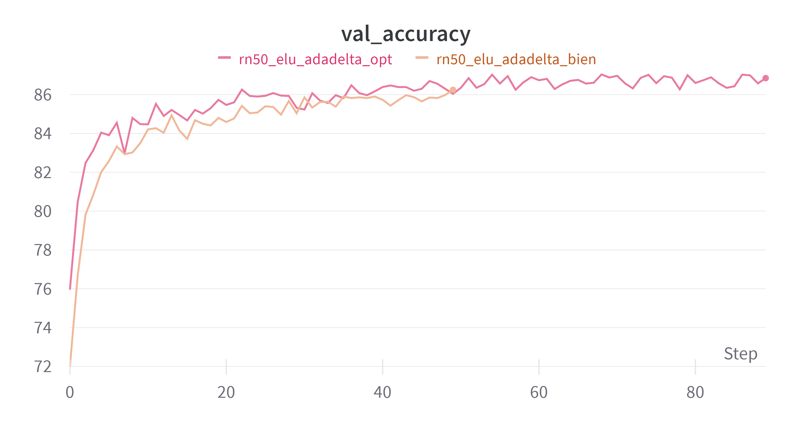

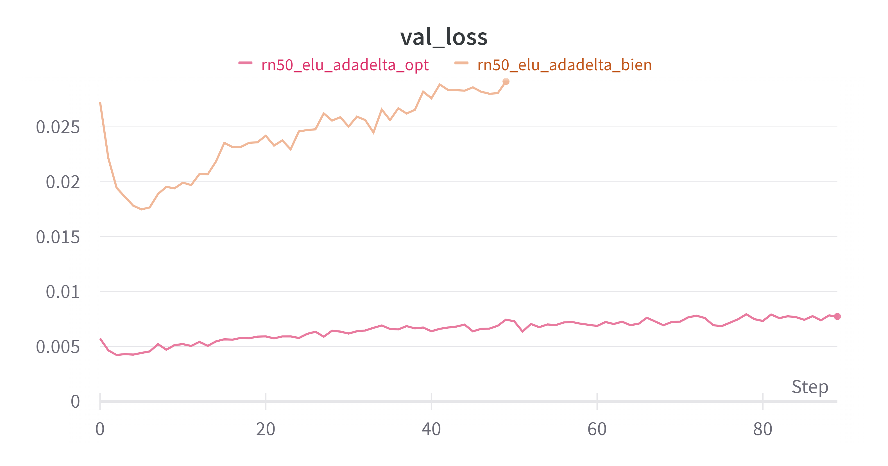

En las figuras 14 y 15 se puede ver como el mismo experimento pero con los hiperparámetros cambiados, logra un mejor rendimiento. Cuando corrimos el experimento con estos parámetros notamos que cambió levemente la performance a pesar de utilizar la misma semilla. A modo de testeo decidimos correr dos veces el mismo código y notamos que hay leves variaciones a pesar de utilizar una seed (ver figura 16). Creemos que se puede deber a la paralelización con GPUs, aunque las diferencias notadas no parecen ser para nada significativas.


Con estos como base, pasamos a probar distintos tipos de regularización.

# Regularización

Dentro de los métodos de regularización, como mencionamos al comienzo del informe ya utilizamos Data Augmentation para el pre-procesamiento de las imágenes. En particular, usamos el `RandomHorizontalFlip(p=0.5)`. A su vez, en esta insatancia con la arquitectura, optimizadores e hiperparámentros seleccionados en base a nuestro experimentos previos, sumamos el uso de *dropout* con distintas probabilidades.

- `rn50_elu_adadelta_dropout_0.2`: Aplicamos dropout a cada una de las capas no convolucionales con probabilidad de dropout de 0.2.
- `rn50_elu_adadelta_dropout_0.5`: Aplicamos dropout a cada una de las capas no convolucionales con probabilidad de dropout de 0.5.

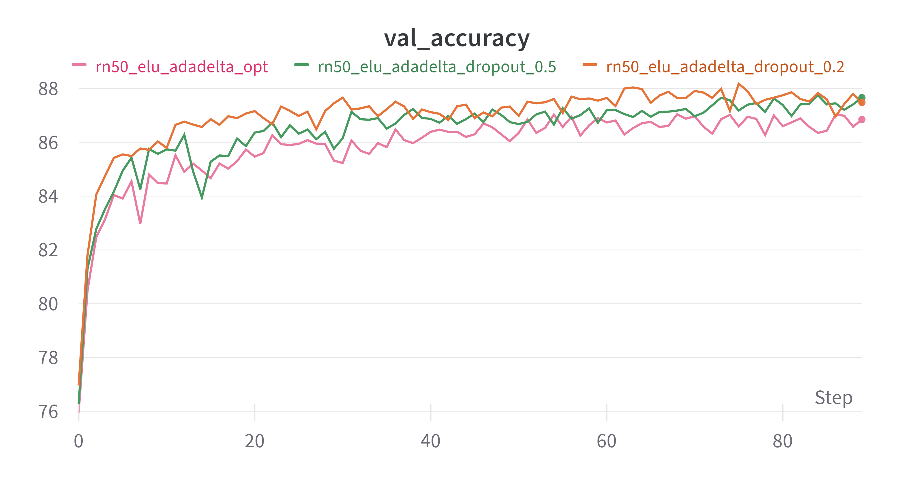

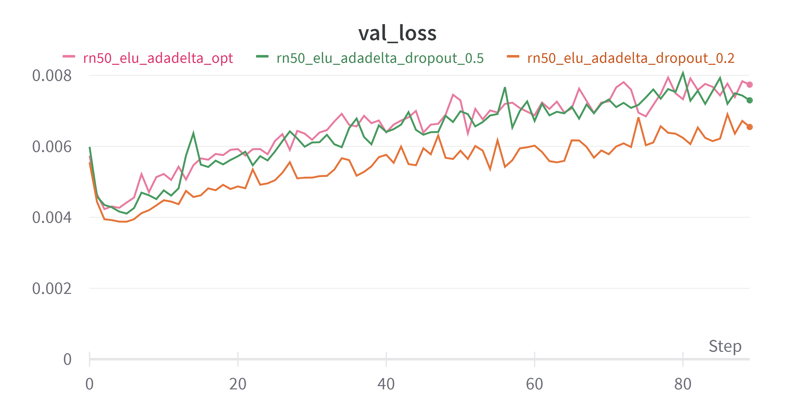

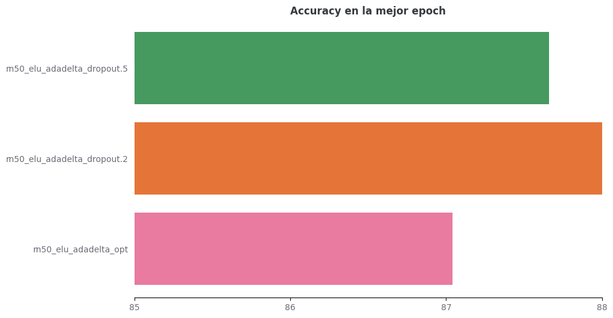

En las figuras 17, 18 y 19 podemos notar que los rendimientos en validation de los experimentos para ambas probabilidades de dropout superan al modelo previo, y si bien el de probabilidad $0.5$ termina levemente arriba que el de probabilidad $0.2$ en la epoch 50, a lo largo de la evolución de los epochs, `rn50_elu_adadelta_dropout_0.2` parece dar los mejores porcentajes de accuracy llegando a $88.18$ en la epoch 75.

# Evaluación final